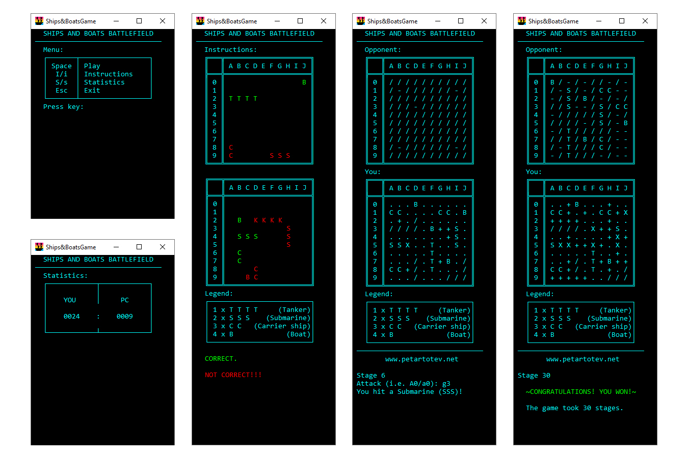

# PT_Console_App_ShipsAndBoatsGame

### ~ Just don't give a ship! ~

**Introduction:**

PT_Console_App_ShipsAndBoatsGame is based on a game I played with my Dad once I was a kid.
The things we needed to enjoy it - 2 pens, 2 sheets of paper and our backs agains each other!

**Rules:**

The game is played by 2 people - YOU and the PC (Opponent).

Both of the sides have a battlefield which is a square matrix (10 x 10).

Both of you have a fleet that consists of 1 Tanker (TTTT), 2 Submarines (SSS), 3 Carriers (CC) and 4 Boats (B).

The Game Engine randomly generates the 10 vessels described above onto YOUr's and also onto PC's battlefield.

The Engine places the 10 vessels of yours and the 10 that belong to the Opponent based on the following rules:

- A Boat (B) could be placed anywhere on the Battlefield - in the corners, on the edges and in the middle of the matrix.
- A Carrier (CC), a Submarine (SSS) or a Tanker (TTTT) could either be placed in the middle of the Battlefield or they could only touch 1 edge of the matrix with only 1 of their segments.
- 2 vessels could not touch - either by their sides or diagonally.
- In other words - all the slots that surround a vessel (the ones on the left, on the right, on the top and on the bottom and the 4 "diagonal" slots should be left empty (no vessels there!)).
- It is always the Opponent who starts the game by playing first.
- You shoot at your Opponent's battlefield by giving 2 coordinates - first one for column (A-J), then for row (0-9) (for example B6 or j9). 
- If you hit a vessel is would be your turn again until you miss and hit a blank slot.
- If you hit a vessel you would see onto the Opponent's battlefield T/S/C/B.
- If you hit at a vessel twice it would change from T/S/C/B to X.
- The winner is the one that is the first to destroy all of their enemy's vessels.

**Files:**

PT_Console_App_ShipsAndBoatsGame - The Project

PT_Console_App_ShipsAndBoatsGame.Tests - The Unit Tests

PT_Console_App_ShipsAndBoatsGame.ico - Logo/Ico ((S)hips and (B)oats)

PT_Console_App_ShipsAndBoatsGame.jpg - Screenshots of the Game

PT_Console_App_ShipsAndBoatsGame.sln - The Solution

PT_Console_App_ShipsAndBoatsGame20200630.rar - The Publish (all the .dll-s, .exe and .ico) archived - all you need to start UI playing )))

~ I would be more than happy if you try it, check the code, leave a comment! ~
