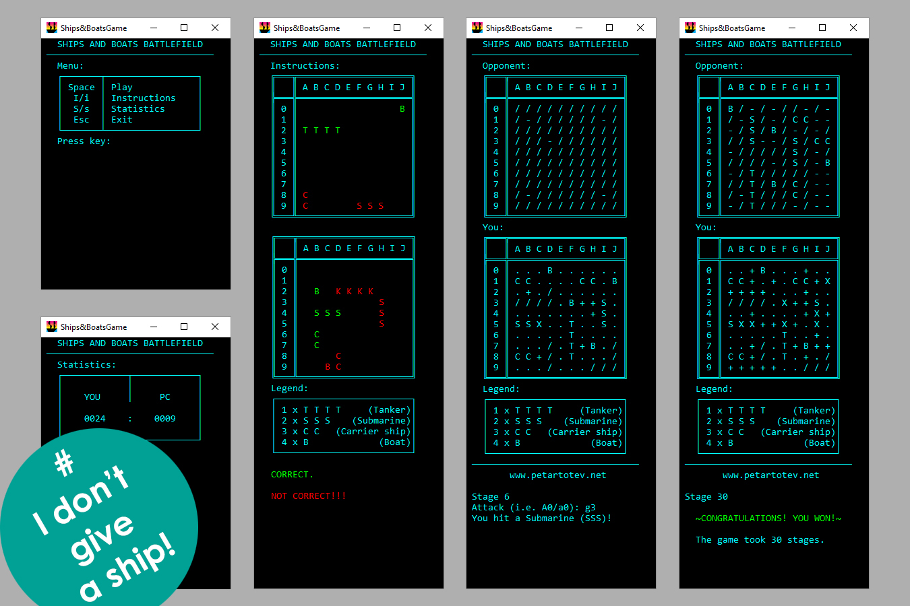

# PT_ConsoleApp_GameShipsAndBoats

## General Information

PT_ConsoleApp_GameShipsAndBoats is a familiar paper-and-pencil game I used to play with my father when I was a child.  
What we needed were 2 pens, 2 sheets of paper and our backs agains each other!

20 years later, I decided to implement the game as a console application.  
The most interesting challenge was the "AI" algorithm that I needed to write for the role of the Opponent (PC).  
Once it hits anything - what slot should it attack and what slots should it consider pointless...

## Technologies

- NUnit
- System.Data.SqlClient

## Rules\*

There are 2 players - YOU and the Opponent (PC).

Both of the sides have a battlefield which is a square matrix (10 x 10 slots).

Both of you have a fleet that consists of:

- 1 Tanker (TTTT)
- 2 Submarines (SSS)
- 3 Carriers (CC)
- 4 Boats (B)

The Game Engine randomly generates the 10 vessels described above on your battlefield as well as on the Opponent's.

The Engine places them according to the following rules:

- A Boat (B) could be placed anywhere - in the corners, on the edges and in the middle of the battlefield
- A Carrier (CC), a Submarine (SSS) or a Tanker (TTTT) could be placed in the middle of the battlefield or they could only touch an edge of the matrix with only 1 of their segments
- 2 vessels cannot touch - either by a sides or diagonally
- All slots surrounding a vessel (left, right, top, bottom and the 4 "diagonal" slots should be left empty

The Gameplay follows these simple rules:

- The Opponent starts the game by playing first.
- You shoot at your Opponent's battlefield by giving 2 coordinates - first one for column (A-J), then for row (0-9).  
  For example: B6, j0, a1 etc. (case insensitive)

- Once you hit a vessel it is your turn again - until you hit a blank slot
- If you hit a vessel the slot on the Opponent's battlefield will turn to 'T'/'S'/'C'/'B'
- If you hit at a vessel twice it would change from 'T'/'S'/'C'/'B' to 'X'

The one to destroy all enemy's vessels wins.

\* If you are about to play the game - please go to Instructions from the menu and watch the animated examples.

## Contents

The solution contains 2 directories:

- src
  - GameShipsAndBoats.Game (.NET Core Console Application)
  - GameShipsAndBoats.Game.Tests (NUnit test project)
- res
  - Screenshots
    - PT_ConsoleApp_GameShipsAndBoats.jpg
  - .ico

\~THE END\~
